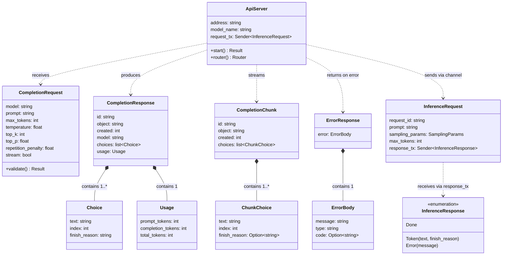
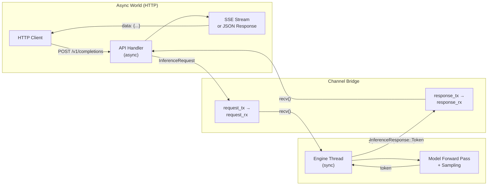
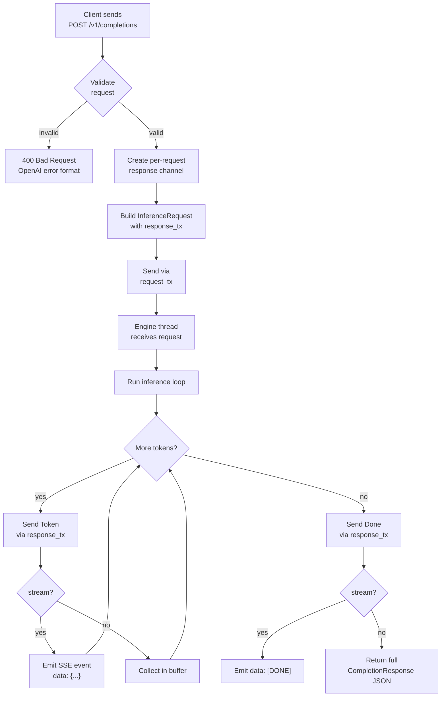

# Chapter 15 -- Component Diagram: Building the API Server

## API Server Structure

**Figure 15.1** — API server components. The server receives OpenAI-format requests, validates them, and bridges to the inference engine via channels. Responses are either a single CompletionResponse (non-streaming) or a series of CompletionChunks (streaming).

## Async/Sync Bridge Data Flow

**Figure 15.2** — The async/sync bridge. HTTP handlers live in the async world; the inference engine runs on a sync thread. Channels connect them: one shared channel for submitting requests, one per-request channel for streaming tokens back.

## Request Lifecycle

**Figure 15.3** — Full request lifecycle from client to response. The request is validated, sent through the channel bridge, processed by the engine, and tokens flow back either as SSE events (streaming) or collected into a single JSON response (non-streaming).
