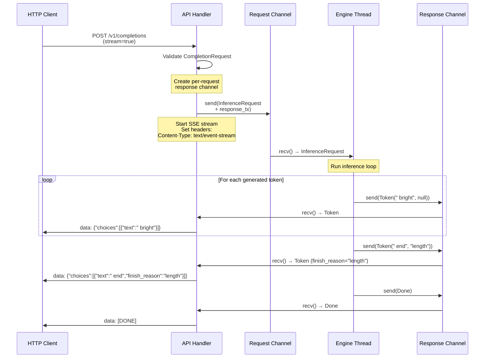
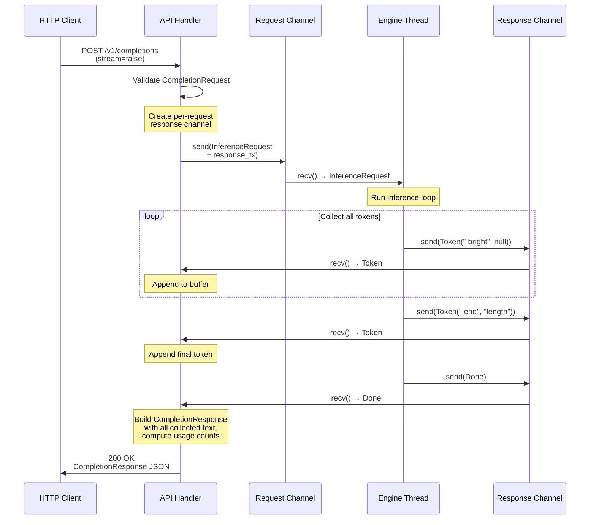
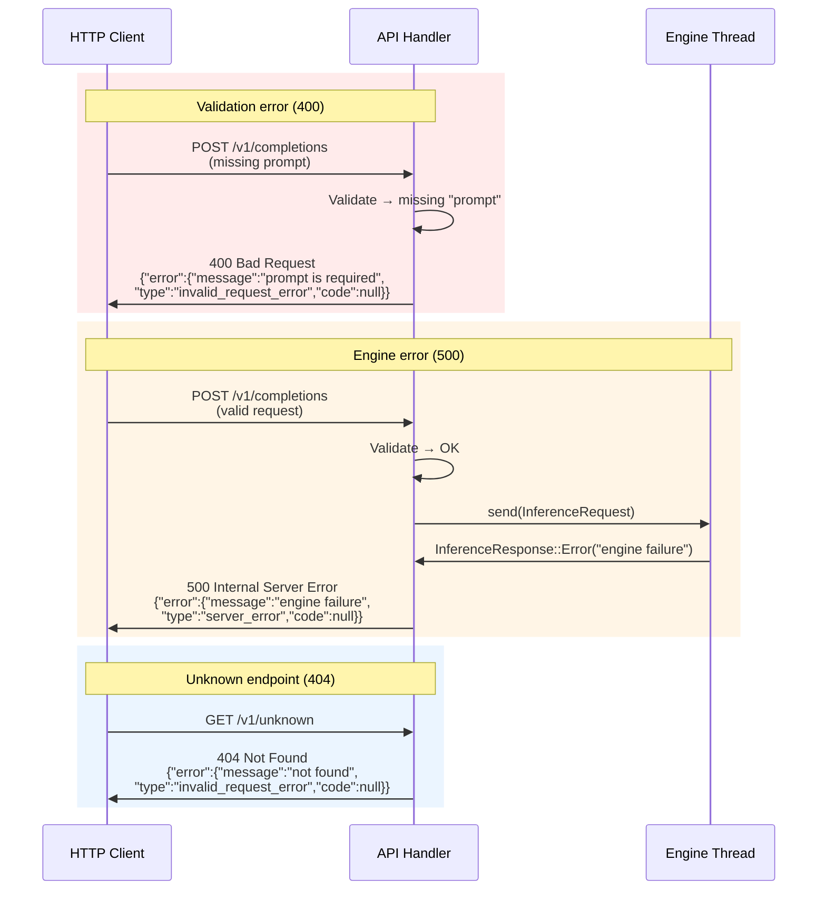

# Chapter 15 -- Sequence Diagram: Building the API Server

## Diagram 1: Streaming Completion Request

**Figure 15.4** — Streaming completion lifecycle. The handler opens an SSE stream, then forwards each token from the response channel as a `data:` event. The `[DONE]` sentinel signals end-of-stream.

## Diagram 2: Non-Streaming Completion Request

**Figure 15.5** — Non-streaming completion. The handler collects all tokens from the response channel into a buffer, then returns a single CompletionResponse JSON with the full text, choices, and usage.

## Diagram 3: Error Handling Flow

**Figure 15.6** — Error handling paths. Validation failures return 400 before reaching the engine. Engine errors return 500. Unknown endpoints return 404. All errors use the OpenAI error format.
