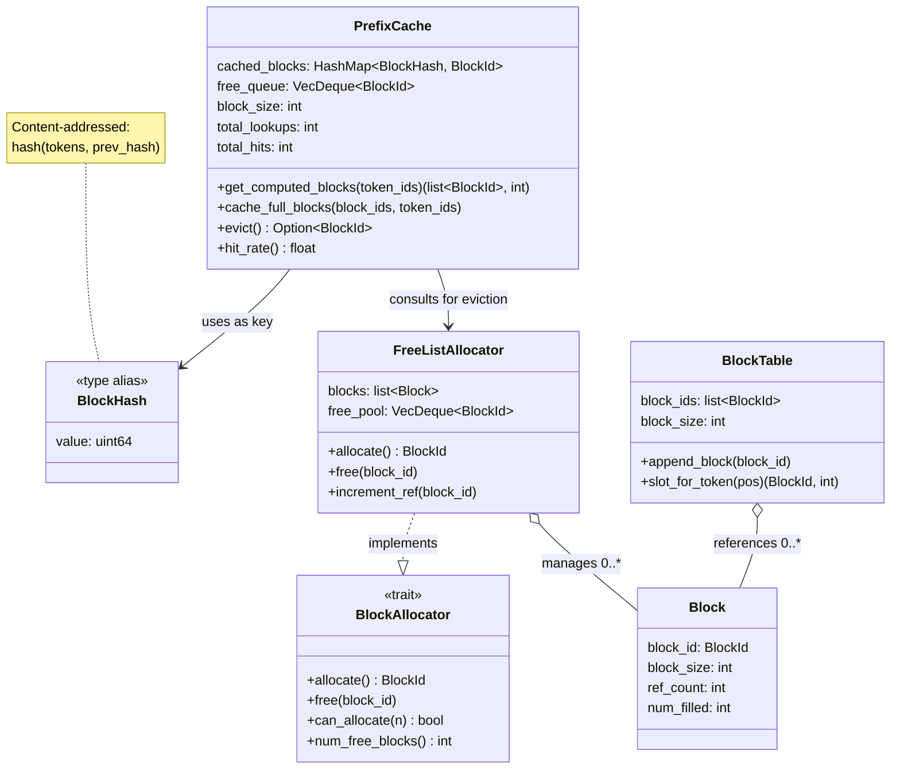
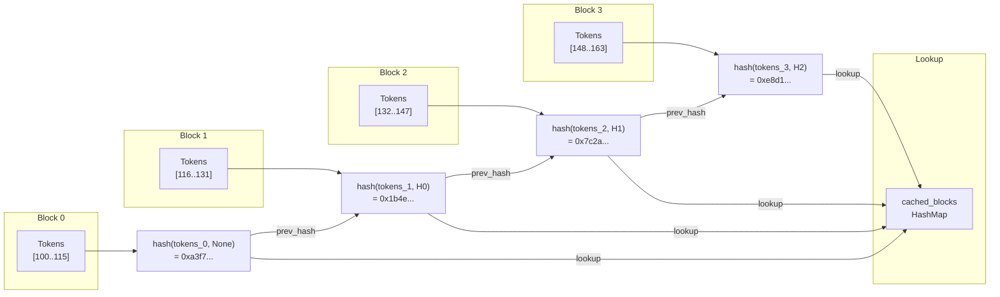
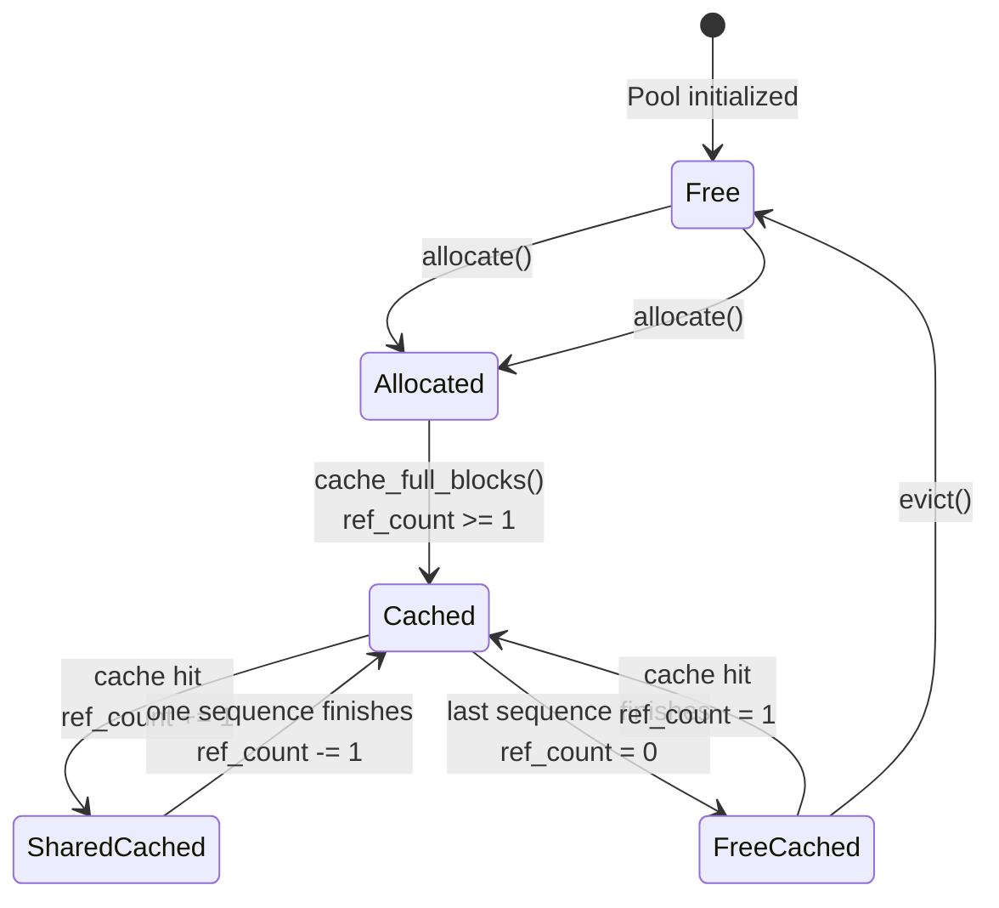

# Chapter 16 -- Component Diagram: Prefix Caching

## PrefixCache Structure

**Figure 16.1** — PrefixCache class structure. The cache maps BlockHash values to physical BlockIds. It works alongside the FreeListAllocator (from ch10), adding content-addressed lookup and LRU eviction. Block ref_count enables sharing between sequences.

## Hash Chaining Flow

**Figure 16.2** — Hash chaining flow. Each block's hash incorporates the previous block's hash, creating a chain. This ensures that identical tokens in different contexts produce different hashes. All hashes are looked up in the cached_blocks HashMap.

## Cache Lifecycle

**Figure 16.3** — Cache lifecycle for a physical block. After allocation and fill, blocks enter the cached state. When ref_count drops to zero, blocks become FreeCached: still in the hash table (can serve hits) but eligible for eviction. Only evict() truly returns a block to the free pool.
