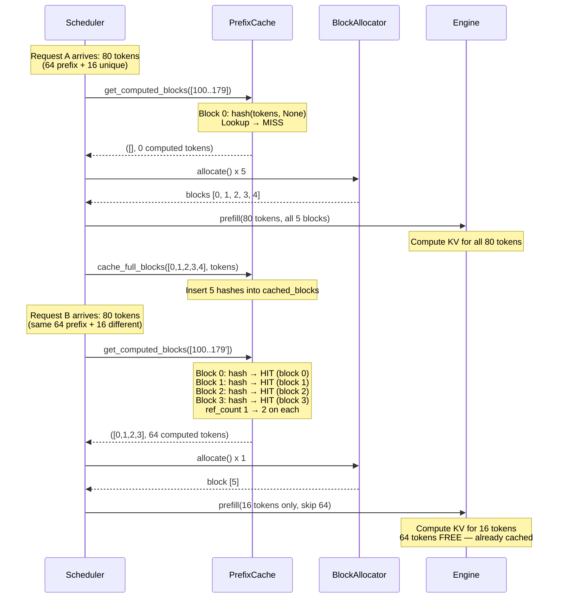
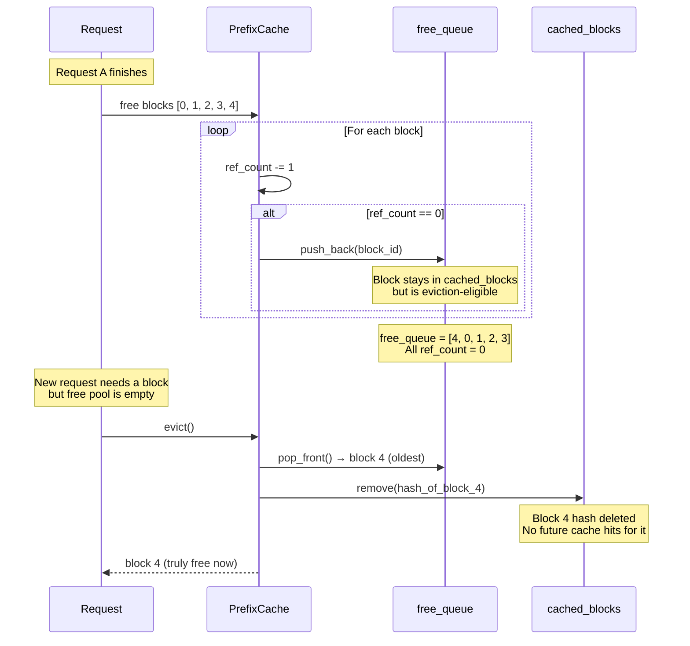
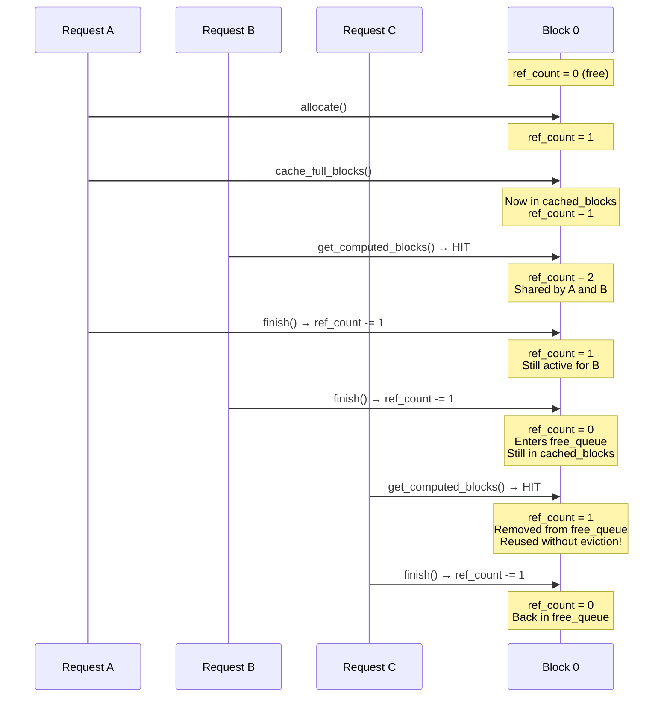

# Chapter 16 -- Sequence Diagram: Prefix Caching

## Diagram 1: Cache Miss Then Cache Hit

**Figure 16.4** — Cache miss then cache hit. Request A populates the prefix cache. Request B with the same prefix gets 4 block hits and only needs to compute KV for 16 new tokens instead of 80.

## Diagram 2: Eviction Flow

**Figure 16.5** — Eviction flow. When a request finishes, its blocks enter the free_queue but remain in cached_blocks. When memory pressure requires a new block, evict() pops the oldest from free_queue and removes it from the hash table.

## Diagram 3: ref_count Lifecycle

**Figure 16.6** — ref_count lifecycle for a shared block. Request A allocates, Request B shares via cache hit, both finish, and Request C reuses the freed-but-cached block without eviction. The block transitions between active and free-cached states based on ref_count.
