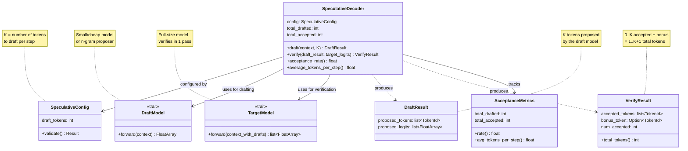
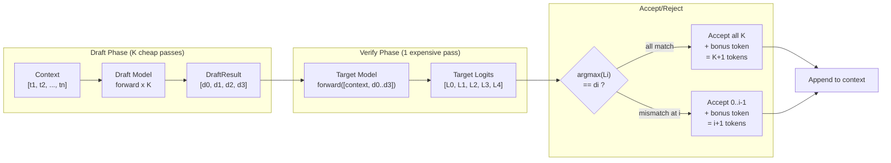
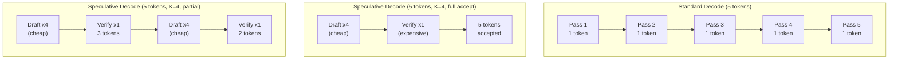

# Chapter 17 -- Component Diagram: Speculative Decoding

## SpeculativeDecoder Structure

**Figure 17.1** — SpeculativeDecoder orchestrates the draft-then-verify loop. A cheap DraftModel proposes tokens; the full TargetModel verifies them in one pass. AcceptanceMetrics tracks how often the draft model guesses correctly.

## Draft-Then-Verify Flow

**Figure 17.2** — The speculative decoding flow. The draft model runs K cheap forward passes to propose tokens. The target model verifies all K in one expensive forward pass. Tokens are accepted until the first mismatch; the target's choice at that position becomes the bonus token.

## Speedup Comparison

**Figure 17.3** — Speedup comparison. Standard decode needs 5 target forward passes for 5 tokens. With speculation and full acceptance, 1 draft+verify cycle produces all 5. With partial acceptance, 2 cycles suffice. The draft passes are cheap (small model), so the wall-clock savings can be substantial.
