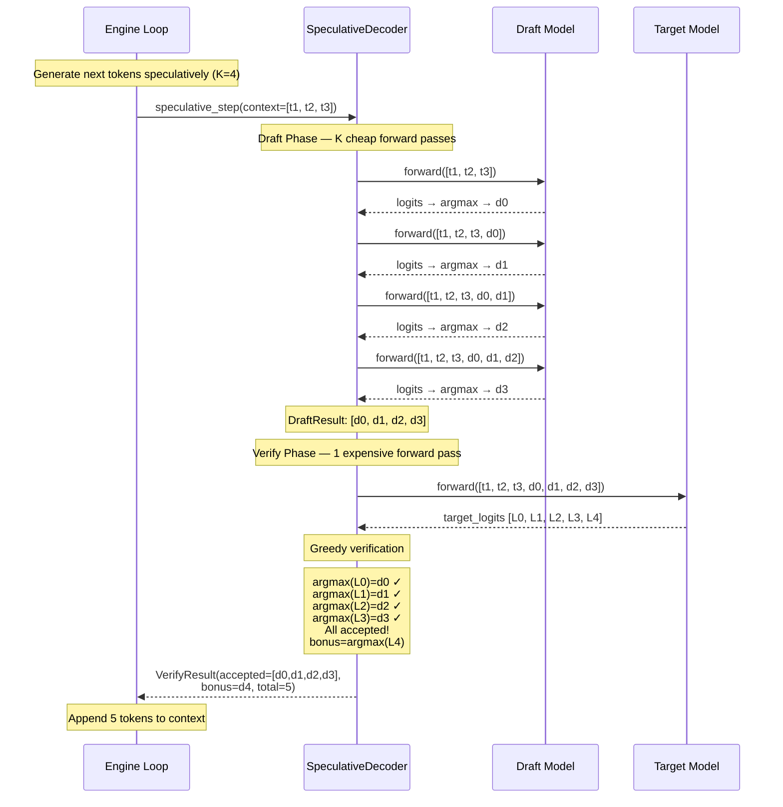
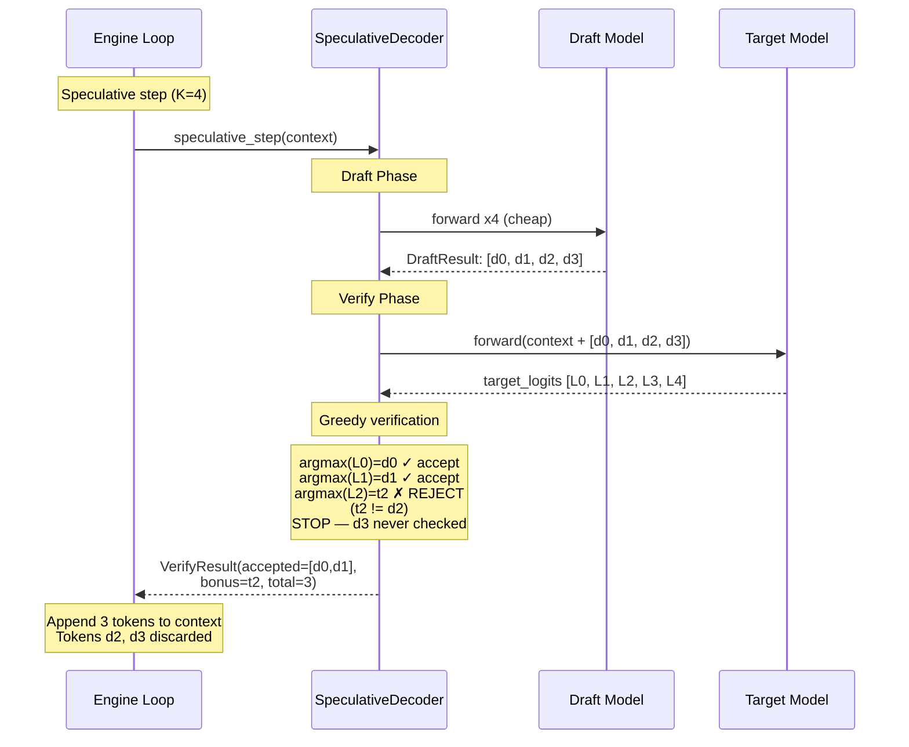
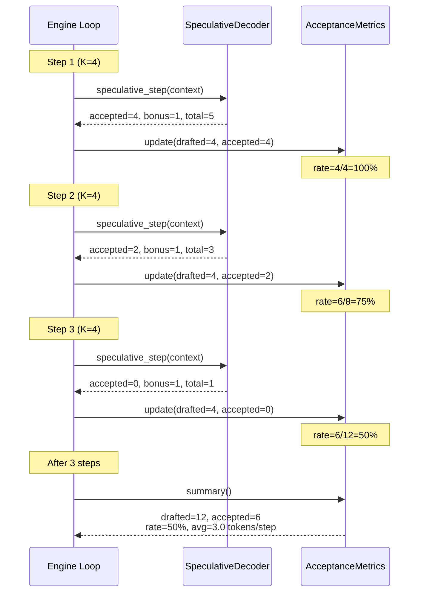

# Chapter 17 -- Sequence Diagram: Speculative Decoding

## Diagram 1: Full Accept Scenario

**Figure 17.4** — Full acceptance scenario. The draft model proposes 4 tokens, the target model confirms all 4 match, and a bonus 5th token is produced. Total: 5 tokens from 1 target forward pass.

## Diagram 2: Partial Accept Scenario

**Figure 17.5** — Partial acceptance. Draft proposed 4 tokens, but the target model disagrees at position 2. Tokens d0 and d1 are accepted; the target's choice (t2) becomes the bonus. Tokens d2 and d3 are discarded. Total: 3 tokens.

## Diagram 3: Multi-Step Loop with Varying Acceptance

**Figure 17.6** — Three speculative decode steps with varying acceptance. Step 1: full accept (5 tokens). Step 2: partial accept (3 tokens). Step 3: immediate reject (1 token). The running acceptance rate drops from 100% to 50%. Average tokens per target pass: 3.0 (still 3x better than standard decode).
