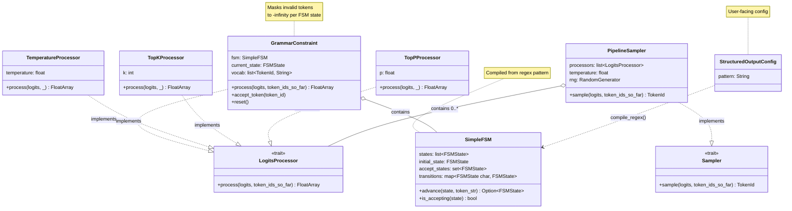
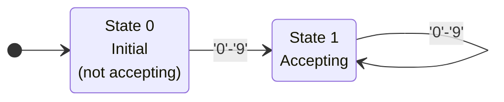
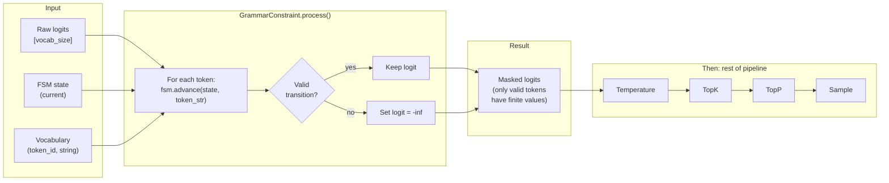

# Chapter 18 -- Component Diagram: Structured Output

## Structured Output Class Structure

**Figure 18.1** — Structured output class structure. GrammarConstraint implements the LogitsProcessor trait from ch14, wrapping a SimpleFSM compiled from a regex pattern. It plugs into PipelineSampler alongside temperature, top-k, and top-p processors.

## FSM State Diagram for `[0-9]+`

**Figure 18.2** — FSM state diagram for the pattern `[0-9]+`. State 0 is the initial state (not accepting). Any digit transitions to State 1 (accepting). State 1 loops on digits, allowing one or more digits total.

## Token Masking Flow

**Figure 18.3** — Token masking flow. For each token in the vocabulary, the GrammarConstraint checks if the FSM can consume that token's string from the current state. Invalid tokens get their logits set to negative infinity. The masked logits then flow through the rest of the sampling pipeline.
