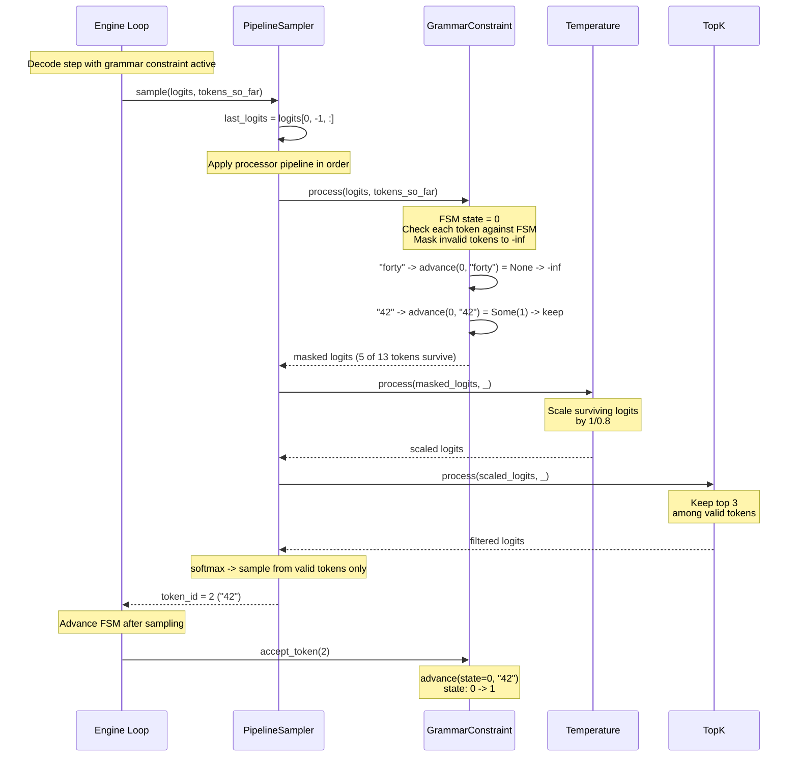
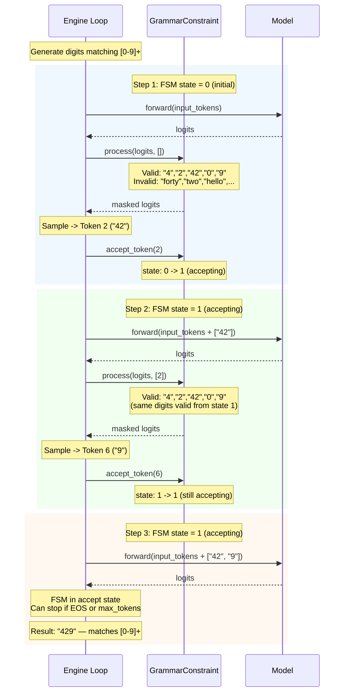
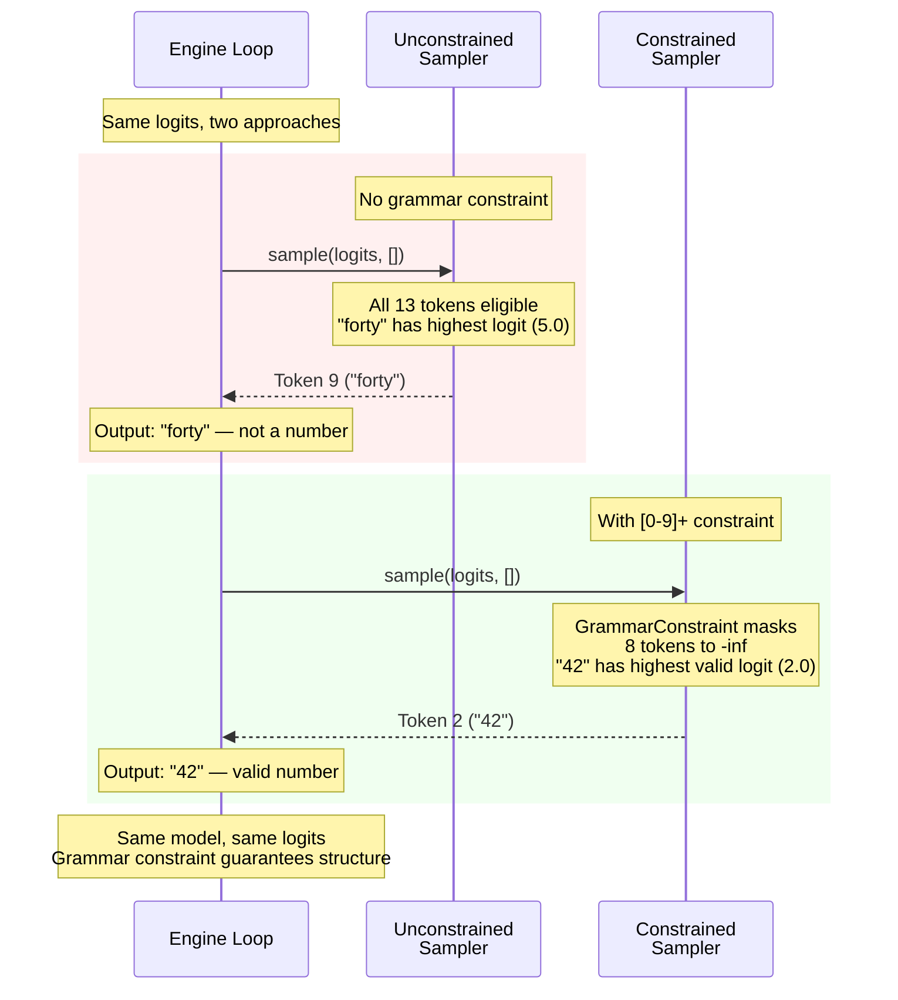

# Chapter 18 -- Sequence Diagram: Structured Output

## Diagram 1: Constrained Decode Step

**Figure 18.4** — A single constrained decode step. GrammarConstraint runs first in the pipeline, masking invalid tokens. Temperature and top-k only see valid tokens. After sampling, the engine advances the FSM state.

## Diagram 2: Multi-Step Constrained Generation

**Figure 18.5** — Multi-step constrained generation. Each step masks logits according to the current FSM state, samples a valid token, and advances the FSM. The FSM reaches an accepting state after the first digit, and stays accepting as more digits are generated.

## Diagram 3: Unconstrained vs Constrained Comparison

**Figure 18.6** — Unconstrained vs constrained sampling with the same logits. Without constraints, the model picks "forty" (highest logit). With `[0-9]+` constraint, non-digit tokens are masked and the model picks "42" (highest valid logit).
