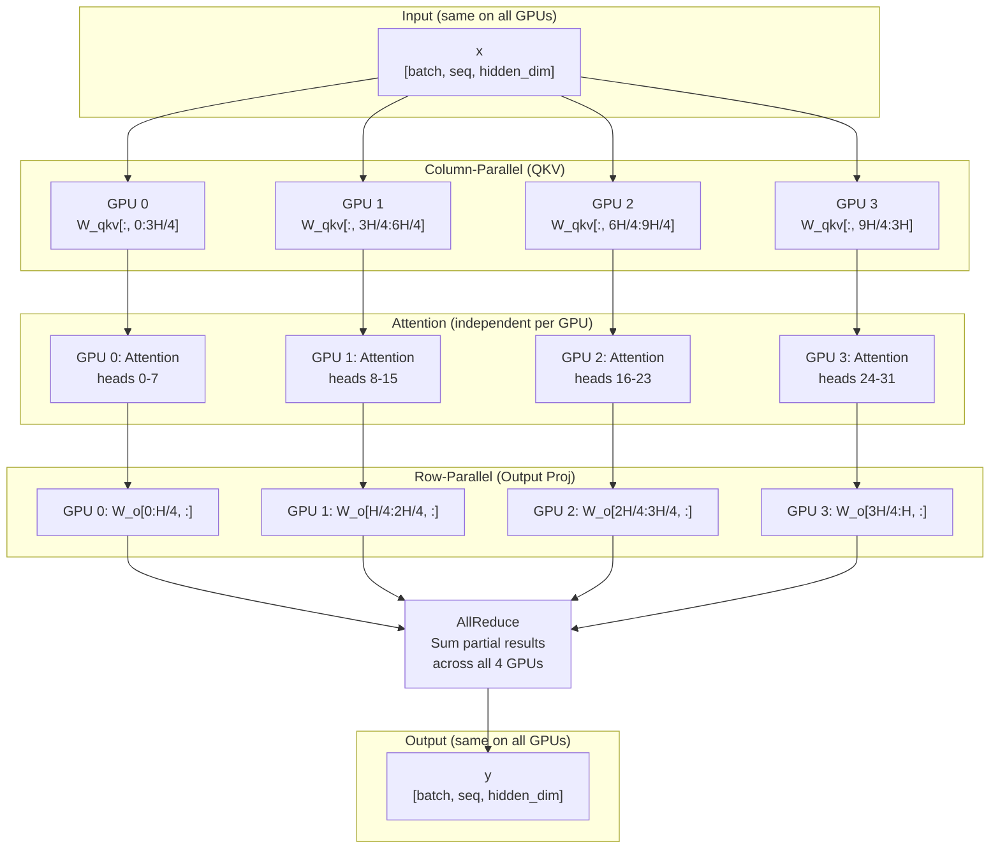
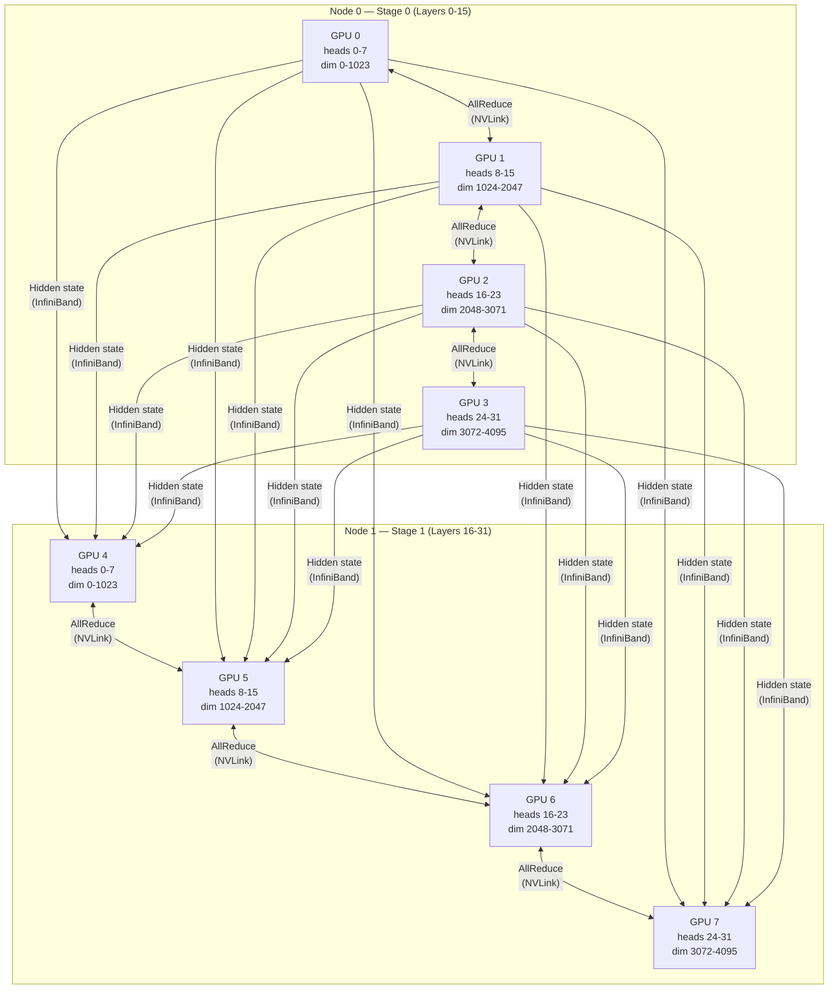

# Chapter 19 -- Component Diagrams: Parallelism

## Tensor Parallelism -- Weight Splitting with AllReduce

**Figure 19.1** -- Tensor parallelism for one attention layer with TP=4. Input is replicated to all GPUs. QKV projection is column-parallel (each GPU computes a slice). Output projection is row-parallel (partial results summed via AllReduce).

## Pipeline Parallelism -- Layers Distributed Across Stages

```mermaid
flowchart LR
    subgraph "Stage 0<br/>GPU 0"
        L0["Layer 0"]
        L1["Layer 1"]
        L2["..."]
        L7["Layer 7"]
        L0 --> L1 --> L2 --> L7
    end

    subgraph "Stage 1<br/>GPU 1"
        L8["Layer 8"]
        L9["Layer 9"]
        L10["..."]
        L15["Layer 15"]
        L8 --> L9 --> L10 --> L15
    end

    subgraph "Stage 2<br/>GPU 2"
        L16["Layer 16"]
        L17["Layer 17"]
        L18["..."]
        L23["Layer 23"]
        L16 --> L17 --> L18 --> L23
    end

    subgraph "Stage 3<br/>GPU 3"
        L24["Layer 24"]
        L25["Layer 25"]
        L26["..."]
        L31["Layer 31"]
        L24 --> L25 --> L26 --> L31
    end

    L7 -->|"hidden state<br/>transfer"| L8
    L15 -->|"hidden state<br/>transfer"| L16
    L23 -->|"hidden state<br/>transfer"| L24
```

**Figure 19.2** -- Pipeline parallelism with PP=4. The 32-layer model is split into 4 stages of 8 layers each. Hidden states are transferred between stages via point-to-point communication.

## Pipeline Bubble -- Idle Time Without batch_queue

```mermaid
gantt
    title Pipeline Timeline — Naive (2 Batches, 4 Stages)
    dateFormat X
    axisFormat %s

    section Stage 0
    Batch 0   :b0s0, 0, 1
    idle      :done, i0a, 1, 4
    Batch 1   :b1s0, 4, 5
    idle      :done, i0b, 5, 8

    section Stage 1
    idle      :done, i1a, 0, 1
    Batch 0   :b0s1, 1, 2
    idle      :done, i1b, 2, 5
    Batch 1   :b1s1, 5, 6
    idle      :done, i1c, 6, 8

    section Stage 2
    idle      :done, i2a, 0, 2
    Batch 0   :b0s2, 2, 3
    idle      :done, i2b, 3, 6
    Batch 1   :b1s2, 6, 7
    idle      :done, i2c, 7, 8

    section Stage 3
    idle      :done, i3a, 0, 3
    Batch 0   :b0s3, 3, 4
    idle      :done, i3b, 4, 7
    Batch 1   :b1s3, 7, 8
```

**Figure 19.3** -- Pipeline bubble with naive scheduling. Each stage is active for only 2 out of 8 timesteps (25% utilization). The grey "idle" blocks are pipeline bubbles -- wasted GPU time.

## Combined TP+PP -- 8 GPU Layout

**Figure 19.4** -- Combined TP+PP with 8 GPUs. TP=4 within each node (high-bandwidth NVLink for AllReduce). PP=2 across nodes (InfiniBand for hidden state transfers between stages).
