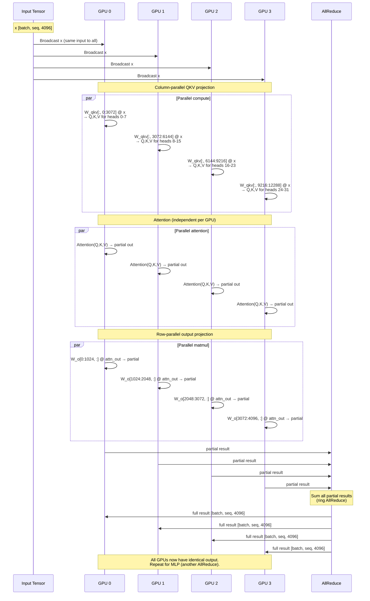
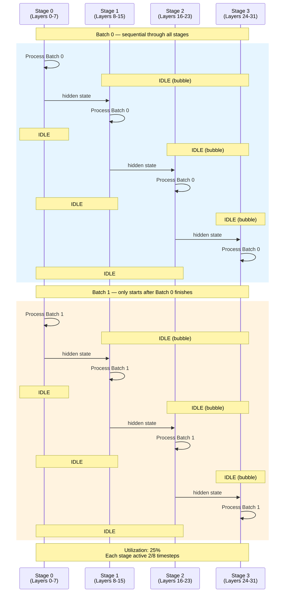
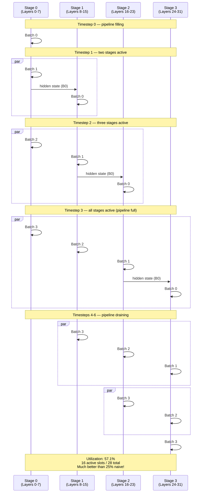

# Chapter 19 -- Sequence Diagrams: Parallelism

## TP Forward Pass -- Split, Compute, AllReduce

**Figure 19.5** -- Tensor parallelism forward pass for one attention layer. Input is broadcast to all GPUs. Each GPU computes its slice (column-parallel QKV, independent attention, row-parallel output). AllReduce sums the partial results so every GPU has the full output.

## PP Without batch_queue -- Sequential Batches

**Figure 19.6** -- Pipeline parallelism without batch_queue. Batch 0 flows through all 4 stages before Batch 1 starts. At any given timestep, 3 out of 4 stages are idle. This is the pipeline bubble problem.

## PP With batch_queue -- Overlapped Micro-Batches

**Figure 19.7** -- Pipeline parallelism with batch_queue. Micro-batches overlap: as soon as Stage 0 finishes Batch 0, it starts Batch 1 while Stage 1 processes Batch 0. After the pipeline fills (timestep 3), all stages are active simultaneously. Bubbles only exist during pipeline fill and drain.
